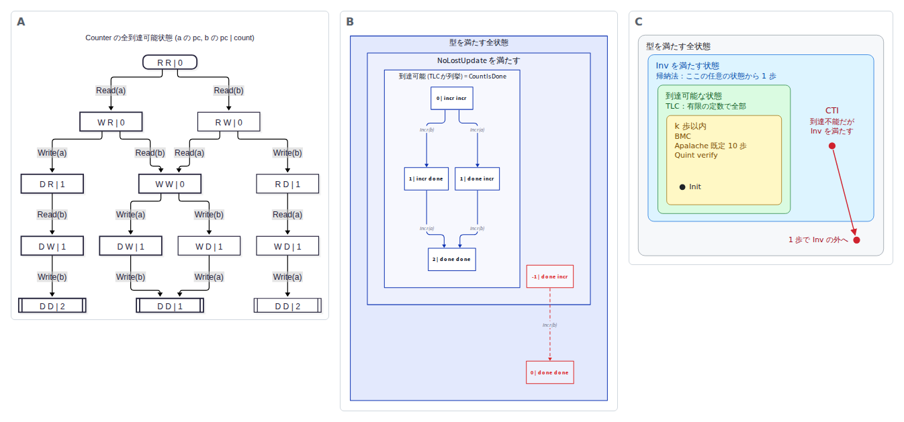
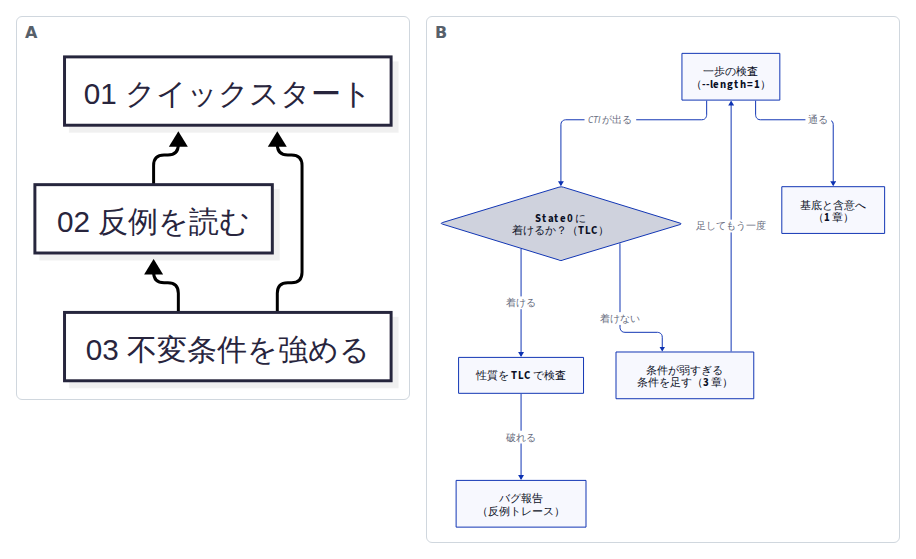
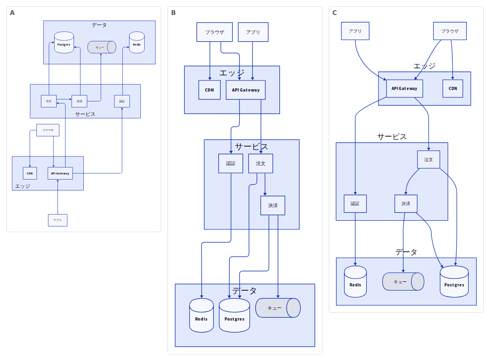
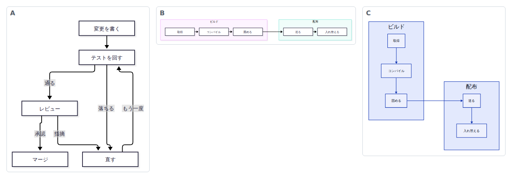
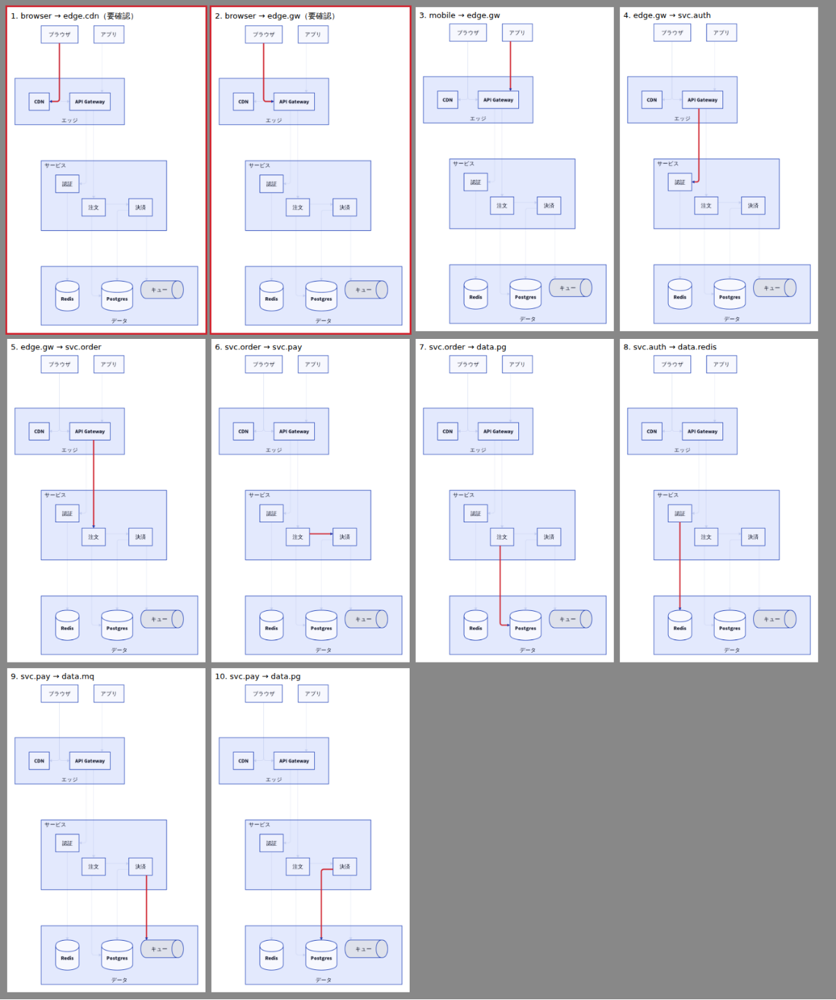
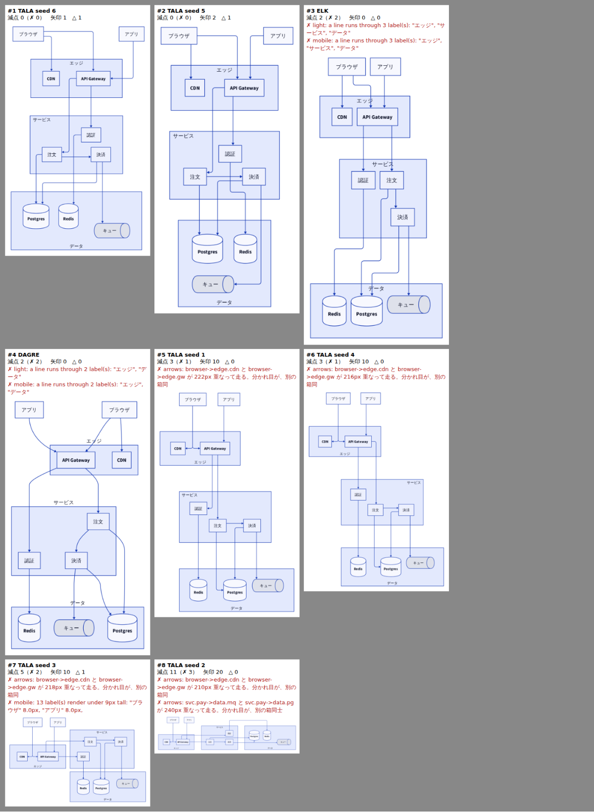
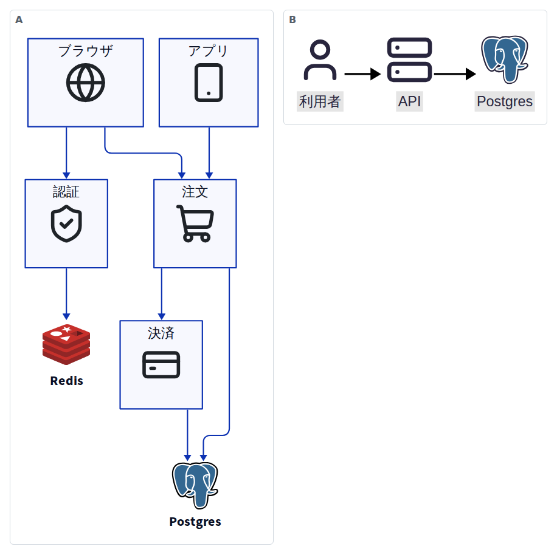

# explainer

[English](README.md) | 日本語

AI から人間へ概念を説明するための、スキルと道具です。

コーディングエージェントが書く速さに、人間の理解が追いつかなくなっています（[Geoffrey Litt, *Understanding is the new bottleneck*](https://www.geoffreylitt.com/2026/07/02/understanding-is-the-new-bottleneck)）。
このリポジトリは、読み手 1 人のために、**その人が知らないことだけ**を、**道具で検証した主張と図**で書くためのものです。

## インストール

Claude Code のプラグインとして入れる場合（このリポジトリがそのままマーケットプレイスで、プラグイン `explainer` に 3 つのスキルが入っています）：

```
/plugin marketplace add mizchi/explainer
/plugin install explainer@explainer
```

シェルからは `claude plugin marketplace add mizchi/explainer` と `claude plugin install explainer@explainer` です。

[`npx skills`](https://github.com/vercel-labs/skills) や [APM](https://github.com/microsoft/apm) でも入れられます（skills 1.7.0 と apm-cli 0.32.0 で確認。どちらも 3 つのスキルを `.claude/skills/` に置き、中身はこのリポジトリと同じでした）。

```sh
npx skills add mizchi/explainer --skill '*' -a claude-code   # 先に --list で一覧を見られる
apm install mizchi/explainer --target claude
```

3 つとも入れてください。`explainer-book` は、隣のディレクトリにある `explainer` の `verify-doc.mjs`（`../../explainer/scripts/`）を呼びます。

| スキル | 使う場面 |
|---|---|
| `explainer` | 1 人の読み手に向けた速習資料。主張と図を道具で検証する |
| `explainer-book` | 章立ての学習資料。学習目標・概念の順序・読了時間・演習を検査する |
| `first-reader` | 公開前の下書きを、模擬読者に 1 段落ずつ読ませる。どこで離脱し、翌日何が残ったかを報告する。書き直しはしない |

スクリプトの依存は、資料を置くリポジトリに入れます（`npm i -D @mizchi/vlmkit @mizchi/vlmkit-anim marked playwright`、Node 24+）。Mermaid の図を使うなら `mermaid`、アイコンを使うなら `@iconify-json/lucide @iconify-json/logos` も入れます。
`first-reader` は Python 3 の標準ライブラリだけで動きます。

`first-reader` は [Shubhamsaboo/awesome-llm-apps](https://github.com/Shubhamsaboo/awesome-llm-apps/tree/main/agent_skills/first-reader) からの同梱です（Apache-2.0、`skills/first-reader/LICENSE` と `NOTICE`）。
日本語の下書きでも 1 段落ずつ読ませられるよう、`feed.py` の語数の数え方を変えています。

## 何をするか

```
ペルソナ ─→ 問い ─→ 実物（実行できる例・モデル） ─→ 本文 + 図 ─→ 検証 ─→ HTML
  │                          │                          │           │
  質問 + 公開情報        出力は貼る。打ち直さない     vlmkit-anim   verify-doc.mjs
                                                   事実シート照合  (checks / 図 / 引用 / vlmkit)
```

- **ペルソナ**（`personas/`）：読み手が既に知っていることと、怪しいところ。資料から何を削るかを決める。
- **スキル**（`skills/explainer/`）：手順、文体、図の選び方、検証の仕方。
- **検証**：本文に引用した出力は `checks.json` で再実行して照合します。図は [`@mizchi/vlmkit-anim`](https://github.com/mizchi/vlmkit) で事実シートと照合し、ページは `vlmkit check integrity` / `check a11y contrast` に通します。

[ELI5](https://github.com/dreambigou/eli5) は、読み手を型（年齢・職種）で扱います。
このスキルは、実在の 1 人をペルソナとして扱い、書いた主張を道具で検査します。

## 指示と、生成された図

このリポジトリを作った会話で、実際に出した指示（抜粋）と、その結果できた図です。
図はすべて、道具の出力と照合するか、`figure-check.mjs` の検査を通し、目で見て直したものです。
画像は `npm run readme:images` で作り直せます。

### 1. 形式手法の速習資料

> 試しに、公開情報から mizchi のペルソナを作成して、私が理解できる形式手法の解説ドキュメントを書きたい。Z3 や TLA+ の資料を書こうとしたが、自分で書いていて自信がなくなってしまった
>
> Apalache で帰納法の検査も実際に動かして検証して



- A：Counter の全到達可能状態。TLC の状態グラフから `tlc-to-scene.mjs` で生成した。オレンジの `D D | 1` が、更新が 1 回失われた終状態
- B：CounterAtomic で、到達可能な状態 ⊂ NoLostUpdate ⊂ 全状態。「到達可能」の枠の中身は、TLC が列挙した状態と照合している。赤は、Z3 が見つけた帰納法の反例（CTI）。NoLostUpdate を満たすが到達不能な状態から、一歩で外へ出る
- C：各検査がどの状態を見たか（手書きの SVG）
- 資料：[`docs/formal-methods/README.md`](docs/formal-methods/README.md)

### 2. 章立ての学習資料

> 簡単なテキストでは終わらない、まとまった学習資料を作る場合のスキルを追加したい。foo-book/01-quickstart.md など



- A：章の依存図。`book.json` から生成し、概念を導入より前に使っていないかの検査と同じデータを使う
- B：帰納法の反例（CTI）の切り分け（D2 + ELK）
- 本：[`docs/inductive-invariant-book/`](docs/inductive-invariant-book/README.md)

### 3. 図の道具の使い分け

> TALA と d2 を使って、どういう時にどういう作図ツールを使えばいいか、サンプルを元に、チートシートを作って整理して。



- 同じ `arch.d2` を、A：TALA、B：ELK、C：dagre で描いたもの
- A は direction を書かないと、入口（ブラウザ・アプリ）が下に来た。B と C は、線が箱の名前（エッジ・サービス・データ）を横切った
- チートシート：[`docs/figure-cheatsheet/README.md`](docs/figure-cheatsheet/README.md)

> mermaid との使い分けを書いておく。mermaid で済むときは mermaid にするが、そうでない別の構造化パターンの場合は d2 を検討, d2 では書けない自由記述のとき SVG か HTML を検討する。



- A：Mermaid で済む図（戻る辺のある手順）。検査の ✗ は 0
- B：Mermaid では、サブグラフの中の箱が外とつながると、中の `direction TB` が無視されて横一列になった
- C：同じつなぎ方を D2 + TALA で描くと、中は縦のまま

### 4. 描いてから目で見て、配置を直す

> D2 や mermaid では、セマンティクスから実際にレンダリングしてみたら、明らかに不自然だったり、矢印の可読性が低かったりすることがある。これらを視覚的に確認して修正するフローを入れたい



辺のシート（`figure-check.mjs` が作る）。矢印を 1 本ずつ赤くし、ほかを薄くしたもの。
赤枠の 2 本は、機械の検査で「browser→CDN と browser→API Gateway が 222px 重なって走る」で落ちた辺。分かれ目が、CDN と API Gateway をつなぐ矢印に見える。



配置の候補（`figure-variants.mjs` が作る）。TALA の seed 1〜6・ELK・dagre で描き、減点の少ない順に並べたもの。
✗ が 0 だったのは seed 6 と 5 だけ。ここから目で見て選び、理由をソースのコメントに残す。

### 5. アイコン

> SVGのアイコンセットなどを導入して、それを使えるようにしたい



- `icons.mjs` は、入っている Iconify のアイコンセットから探す。セットは Lucide（線のアイコン、ISC）と logos（技術のロゴ、CC0）。候補を 1 枚に並べて目で選び、選んだアイコンを図の隣に置いて、出典とライセンスを `figures/icons/ICONS.md` に残す。
- A：D2 + ELK。箱の中には線のアイコン、製品そのものにはロゴ。ロゴは `shape: image` で大きさを決めた。決めないと、Postgres のロゴが図の中で一番大きくなった。
- B：Mermaid。`figure-check.mjs` が入っているセットを Mermaid に登録するので、`lucide:user` や `logos:postgresql` をそのまま書ける。
- `figure-check.mjs` は、図に埋め込まれていない画像（ファイルが無い、パスが違う）と、出典の記録が無い D2 のアイコンを落とす。

## 例：mizchi 向けの形式手法の速習資料

- ペルソナ：[`personas/mizchi.md`](personas/mizchi.md)（公開情報から作成。事実と推測を分けて記載）
- 資料：[`docs/formal-methods/README.md`](docs/formal-methods/README.md)「緑を読む：Z3 と TLA+ の『OK』は何を保証したのか」

ペルソナを作ってみると、読み手は形式手法の初心者ではありませんでした。
約 10 種の検証器をエージェント経由で既に回しています。
そこで資料は、ツールの入門ではなく、**検査器の結果が何を保証したかを自分で判定する基準**に絞りました。

## 例：章立ての学習資料（本）

1 本の資料に収まらないときは、`explainer-book` スキルで章立てにします。

- 本：[`docs/inductive-invariant-book/`](docs/inductive-invariant-book/README.md)「帰納的不変条件を自分で見つける」（全 3 章）
  - `01-quickstart.md`：Apalache の 3 つの check で、不変条件が何歩でも成り立つことを示す
  - `02-reading-cti.md`：帰納法の反例（CTI）が、条件の弱さかバグかを TLC で切り分ける
  - `03-strengthening.md`：CTI から足すべき条件を読み取る演習
- 本全体の検査（`verify-book.mjs`）：学習目標と理解度チェックの対応、概念を導入前に使っていないか、章の読了時間、演習の出発点が落ちて答えが通るか、章の依存図

## 例：図の道具の選び方（チートシート）

- 資料：[`docs/figure-cheatsheet/README.md`](docs/figure-cheatsheet/README.md)「どの図を、どの道具で描くか」
- Mermaid で済むなら Mermaid、足りない構造なら D2（TALA / ELK / dagre）、D2 に乗らない自由な図なら SVG / HTML。道具の出力を写す図は vlmkit-anim。同じサンプルを Mermaid と D2 の 3 つのエンジンで描いて比べた結果（`samples/compare.mjs`）つき
- 測って分かったこと：箱の中の向きは、Mermaid だと中の箱が外とつながると無視され、ELK と dagre は常に黙って無視する。守ったのは TALA だけ。TALA は seed で配置がすべて変わり、箱が増えると急に遅くなる

## 使い方

```sh
npm install            # Node 24+（vlmkit の要件）
npm run setup:tla      # TLC と Apalache を .tools/ に取得（Java 17+）
npm run setup:d2       # D2（TALA / ELK）を .tools/ に取得。手で書く D2 の図に使う
npm run verify         # docs/formal-methods を検証 → verdict: VERIFIED
npm run build          # docs/formal-methods/dist/index.html を生成
npm run verify:book    # docs/inductive-invariant-book を検証 → book verdict: VERIFIED
npm run build:book     # docs/inductive-invariant-book/dist/*.html を生成
npm run verify:cheatsheet   # docs/figure-cheatsheet を検証（エンジンの比較を再実行する。2 分ほど）
npm run figure -- docs/formal-methods/figures/coverage.svg   # 図 1 枚を描画・検査。出てきたシートを目で見る
npm run figure:variants -- docs/figure-cheatsheet/figures/arch.d2   # D2 / Mermaid の配置の候補を点数つきで並べる。見比べて選ぶ
npm run test:figures   # figure-check の回帰テスト
npm run readme:images  # README の画像（docs/readme/*.png）を作り直す
npm run icons -- search database --sheet /tmp/icons.png   # アイコンを探し、候補を目で見る。選んだら npm run icons -- add lucide:database
```

## スキルの効果を測る（evals）

`evals/<case>/prompt.md` と `graders/*.md` が、`claude plugin eval` のケースです。
各ケースを、プラグインあり・なしの 2 つの条件で実行し、スコアの差（Δ）を出します。

```sh
claude plugin eval . --trust-plugin --allow-tools Bash Write Edit Agent -j 4
```

| ケース | 見ること |
|---|---|
| `crash-course` | 読み手の既知を省くか。コードを実行して出力を載せるか。理解度チェックがあるか |
| `crash-course-known-heavy` | 専門家向けでも「〜とは」から始めがちな題材（BuildKit のキャッシュ）で、既知を省き、核心を正しく説明するか |
| `crash-course-persona-implicit` | 同じ題材で、既知を依頼文に書かず、ペルソナのファイルにだけ書いたとき |
| `crash-course-persona-build` | 読み手の名前と所属しか分からないとき、書く前に確かめるか、仮定を明示するか。経歴を作り上げないか |
| `book` | 1 章が quickstart か。各章に学習目標と答えつきの問いがあるか。演習の答えを実行して確かめるか |
| `pr-reader-first` | 読み手が分からないとき、書く前に確かめるか、前提を明示するか |
| `one-liner-control` | 対照。1 文で済む質問で、スキルを呼ばず、資料を作らないか |
| `first-reader-no-rewrite` | 下書きのレビューで、読み手の体験を報告し、書き直さないか |

最新の結果と、その読み方の注意は [`evals/RESULTS.md`](evals/RESULTS.md) にあります。
2026-09-25〜27 の回は、シェルに依存しない grader で `crash-course` が +0.43（各 3 回、5 回目）、`crash-course-known-heavy` が +0.25、`crash-course-persona-implicit` が +0.12、`crash-course-persona-build` が +0.20（仮のペルソナを残す規則を足した 9 回目は +0.40。返答の型を足した 10 回目は +0.13 で、ペルソナのファイルは 3 回とも残った）、`pr-reader-first` が +0.50、`book` が +0.28、対照ケースは差なし（過剰発火なし）でした。実行できなかったコードを報告したのは、スキルありで 6 回中 6 回、なしで 6 回中 1 回です。読み手の情報（依頼文でもペルソナのファイルでも）があるときの既知の省略は、スキルなしでもできていました。
その回の環境では eval のサンドボックス内でシェルが動かず、コード実行を見る grader は無効でした。

`first-reader` のスクリプトの単体テストは `python3 tests/first-reader/test_first_reader.py` と `test_cjk.py` です。

## 構成

| パス | 内容 |
|---|---|
| `skills/explainer/SKILL.md` | スキル本体（1 本の速習資料） |
| `skills/explainer-book/SKILL.md` | 本版（章立ての学習資料）。`scripts/verify-book.mjs` が本全体を検査 |
| `skills/explainer/references/` | ペルソナ・文体・図のガイド |
| `skills/explainer/scripts/verify-doc.mjs` | 検証（checks / vlmkit-anim / 引用照合 / vlmkit ゲート） |
| `skills/explainer/scripts/build-html.mjs` | Markdown → 自己完結 HTML |
| `skills/explainer/scripts/icons.mjs` | 入っている Iconify のアイコンセット（lucide・logos）からアイコンを探し、候補を 1 枚に並べ、図の隣に置いて出典とライセンスを ICONS.md に残す |
| `skills/explainer/scripts/tlc-to-scene.mjs` | TLC の状態グラフ・反例 → vlmkit-anim の図と事実シート |
| `skills/explainer/scripts/figure-check.mjs` | 手で書いた SVG / HTML / D2 / Mermaid の図を描画・検査し、目で見るシート（ライト・ダーク・スマホ）を作る |
| `skills/explainer/scripts/figure-arrows.mjs` | 矢印の読みやすさの検査と、辺を 1 本ずつ強調したシート（figure-check が使う） |
| `skills/explainer/scripts/figure-variants.mjs` | D2 / Mermaid の配置の候補（TALA の seed・ELK・dagre、向き）を描き、点数つきで並べる |
| `tests/figure-check/` | figure-check の回帰テスト（悪い図がそれぞれの検査で落ちるか） |
| `personas/` | 読み手のペルソナ |
| `docs/<topic>/` | 資料：`README.md`, `checks.json`, `examples/`, `figures/` |
| `docs/<topic>-book/` | 本：`README.md`（目次）, `book.json`, `NN-*.md`, `checks.json`, `examples/`, `figures/` |
| `docs/readme/` | この README の画像 |
| `skills/first-reader/` | 模擬読者（同梱、Apache-2.0） |
| `.claude-plugin/` | プラグインとマーケットプレイスの定義 |
| `evals/` | `claude plugin eval` のケース |
| `tests/first-reader/` | first-reader のスクリプトの単体テスト |
| `scripts/readme-images.mjs` | README の画像を作り直す |

## ライセンス

[MIT](LICENSE)。
ただし `skills/first-reader/` は同梱元のライセンス（Apache-2.0、`skills/first-reader/LICENSE` と `NOTICE`）に従います。
資料に置いたアイコンは、各セットのライセンスに従います（Lucide は ISC、logos は CC0。ロゴは各社の商標）。アイコンごとに `figures/icons/ICONS.md` に記録します。
