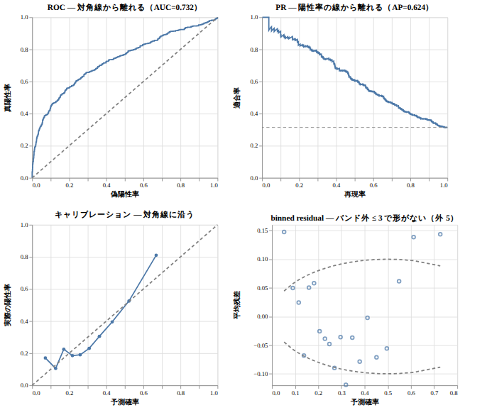
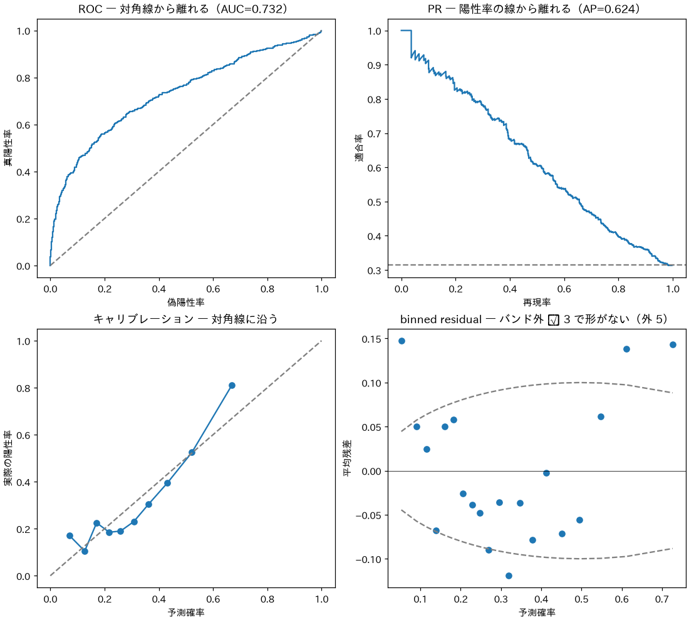
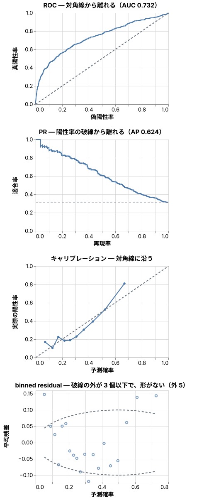

# データの図は Python で描くか、JS / TS で描くか

想定読者：explainer で、モデルの診断や数値の分布を図にして説明する人。
Mermaid・D2・SVG の使い分け（`docs/figure-cheatsheet/`）は知っている前提で、データの図だけを扱う。

この資料は、データの図は **計算は JS で書ければ JS、書けなければ Python、描画は Vega-Lite** にすれば、図の検査が効くことを伝える。

| 節 | 役割 | 見せるもの |
|---|---|---|
| 1 | 何が変わるか | 結論と使い分けの表 |
| 2 | 根拠：同じ計算を両方で | ロジスティック回帰の診断値の照合 |
| 3 | 根拠：検査が届くか | matplotlib と Vega-Lite の SVG を figure-check に通した結果 |
| 4 | 診断の図と判定表の型 | 4 パネルの図と、判定表 |

## 1. 結論

- 描画は Vega-Lite の spec（`figures/<name>.vl.json`）にする。`figure-check.mjs` がそのまま描画・検査する。
- 計算は、集計・ROC / PR・キャリブレーション・GLM の係数と SE までなら JS で書ける。混合効果・Cox・頑健 SE・因子分析・SHAP は Python（statsmodels・lifelines など）が要る。
- matplotlib で描くなら、SVG の文字を輪郭にしない（`svg.fonttype = "none"`）。既定のままだと、文字の検査が 1 つも効かない。

使い分けの表は `skills/explainer/references/figures.md` の「データの図」にある。

## 2. 同じ計算を両方で：小数 6 桁まで一致した

2000 行のデータ（`samples/data.csv`）でロジスティック回帰を当てはめ、診断の値を Python と JS で計算した。
データは、真のモデルに x1² の項があるように作り、当てはめは線形の項だけにした。診断で見つかるべき不適合が 1 つある。

- Python：statsmodels の GLM と scikit-learn（`samples/glm.py`。値は `samples/glm.py.json`）
- JS：`ml-matrix` で IRLS を書き、ROC・PR・キャリブレーション・binned residual は手で書いた（`samples/glm.mjs`）
- 交差検証の分け方は、Python が作って `data.csv` の `fold` 列に入れた。JS も同じ分け方を使う。

<!-- output: glm -->
```
b0          -0.910571  python  -0.910571  一致
b1           0.772060  python   0.772060  一致
b2          -0.560118  python  -0.560118  一致
se_b1        0.058105  python   0.058105  一致
auc          0.732040  python   0.732040  一致
ap           0.623659  python   0.623659  一致
brier        0.178981  python   0.178981  一致
rate         0.314000  python   0.314000  一致
binned_out   5.000000  python   5.000000  一致
```

JS 版は 1 秒かからずに終わる（ブラウザは使わない）。

## 3. 検査が届くか：matplotlib の既定の SVG は、文字の検査を素通りする

同じ 4 パネルを、matplotlib（2 × 2）と Vega-Lite で描き、`figure-check.mjs` に通した。

| 描き方 | 見つかった文字 | 結果 |
|---|---|---|
| matplotlib、既定の SVG | 0 | 文字が path になるので、重なりも小ささも測れない。いまは「drawn as outlines」で落ちる |
| matplotlib、`svg.fonttype = "none"` | 63 | スマホ幅で目盛りが 6px（2 列のため）。落ちる |
| Vega-Lite、2 × 2 | 78 | スマホ幅で目盛りが 5px。落ちる |
| Vega-Lite、縦に 4 段（下の図） | 78 | 通る |

2 × 2 のスマホ幅（目盛りが 5px）：



matplotlib の PNG では、題の `≤` が豆腐（□）になった。日本語のフォント（IPAexGothic）にこの字形が無いため。


`savefig` は `Glyph 8804 ... missing` と警告するだけで、図はそのまま保存される。
ブラウザで描く図の豆腐は、`figure-check.mjs` が「no glyph」で見つける。

## 4. 診断の図と判定表

パネルの題に「何を見る図か — 何が見えれば合格か」を書き、合格の基準の線は破線で描く。



| 診断項目 | 実測値 | 合格基準 | 判定 | 次アクション |
|---|---|---|---|---|
| AUC / AP（陽性率 0.314） | 0.732 / 0.624 | 文脈による。並べて報告する | 確認 | 使う場面で必要な水準を決める |
| Brier | 0.179 | ベースライン 0.314 × 0.686 = 0.215 より小さい | OK | — |
| キャリブレーション | 図 | 対角線に沿う | 確認 | 予測確率 0.6 より上で、実際の陽性率が予測を上回る |
| binned residual のバンド外 | 5 / 20 ビン | 3 以下で、形がない | 要対処 | U 字の形がある。x1 の非線形の項（x1² かスプライン）を入れて当てはめ直す |

判定と次アクションは、図と基準を見て書いた。スクリプトは値を出すだけで、判定はしない。
この型は [atsushi-green/ds-ai-coding-skills](https://github.com/atsushi-green/ds-ai-coding-skills) の diagnostics スキルの考え方を参考にした（ライセンスの記載が無いので、文章とコードは使っていない）。

## 作り直す

```sh
node samples/glm.mjs --write                                        # spec を書き直す
node ../../skills/explainer/scripts/verify-doc.mjs . --write        # SVG を描き直して検査
(cd samples && uv run --with numpy,polars,statsmodels,scikit-learn python glm.py)   # Python の基準値（任意）
```
