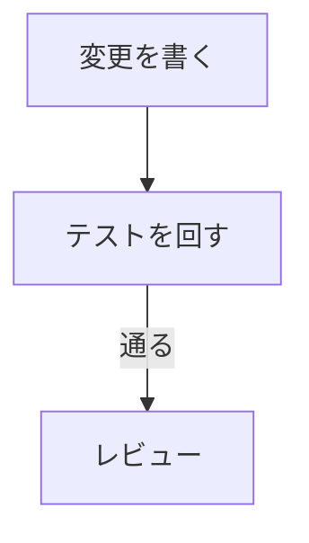
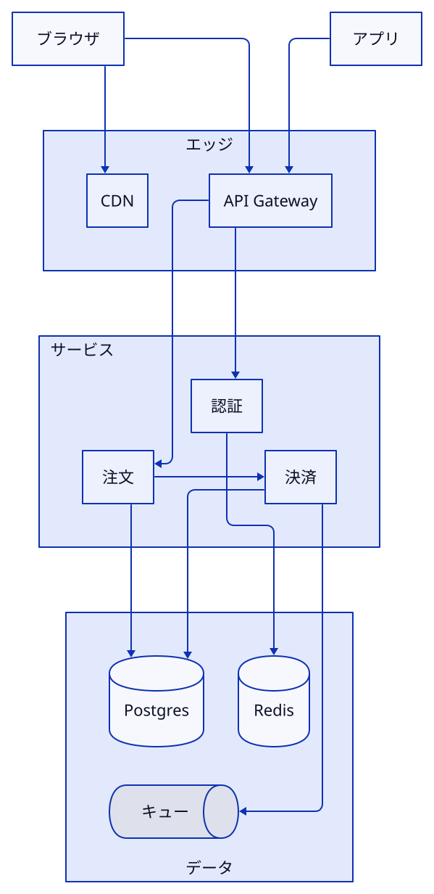
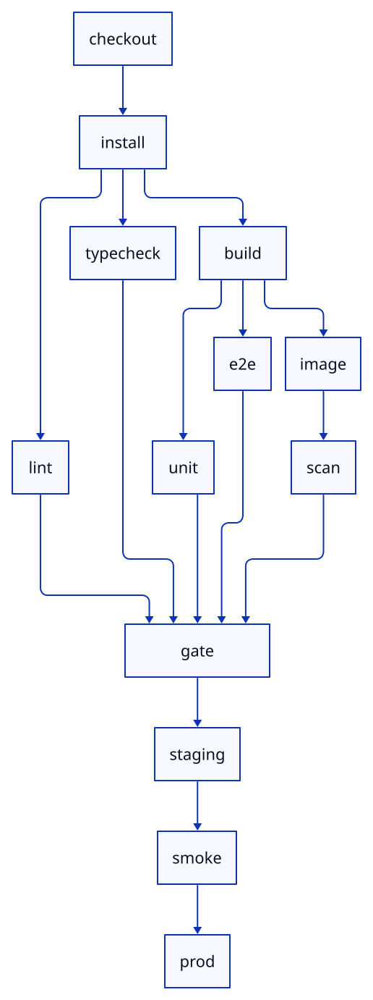
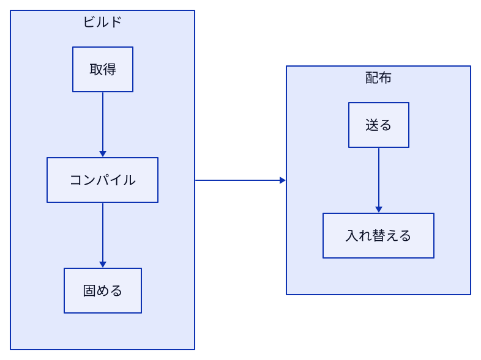
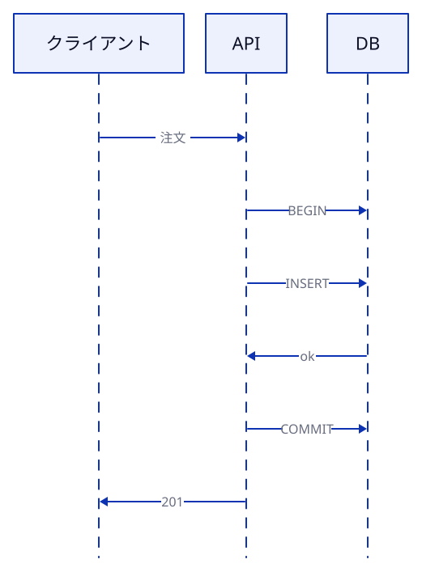

# どの図を、どの道具で描くか：Mermaid・D2（TALA / ELK / dagre）・SVG・HTML・vlmkit-anim

<!-- persona: ../../personas/mizchi.md -->

> **想定読者**：図をエージェントに Mermaid・D2・SVG で書かせていて、どれを使うかをその場の勘で決めている人。
> Mermaid と D2 の文法の入門は省きます。
> 扱うのは 2 つです。どの問いにどの道具とエンジンを使うか。そして、それぞれで実際に起きた失敗です。
> 所要 10 分。
> 道具とエンジンの比較は `samples/compare.mjs` の出力です。同じサンプルを Mermaid と D2 の 3 つのエンジンで描きました。図はすべて `figure-check.mjs` を通し、出てきたシートを目で見ました。
> 本文の出力は `npm run verify:cheatsheet` で再実行して照合しています。
> D2 は v0.9.0 です（TALA が MPL-2.0 で公開され、同梱された版。[d2lang.com/blog/tala-is-open-source](https://d2lang.com/blog/tala-is-open-source/)）。Mermaid は 12.0.0 です。

---

## 0. 一枚で：Mermaid → D2 → SVG / HTML の順に当てる

| 順 | 問い | 道具 | 決め手 |
|---|---|---|---|
| 1 | Mermaid で書けて、描いて崩れないか（フロー・シーケンス・状態遷移など） | **Mermaid** | GitHub の Markdown（PR 本文・Issue・README）が、そのまま図として描く。ビルドが要らず、読み手も直せる |
| 2 | Mermaid では足りない構造か（下の 4 つ） | **D2** | 箱と線の図のまま、配置を細かく決められる |
| 3 | D2 の「箱と線」に乗らない自由な図か | **SVG / HTML** | 位置そのものに意味があるなら SVG。文字とコードが主なら HTML |

Mermaid では足りず、D2 を考えるのは、次のどれかに当たるときです（1 節で測りました）。

- 箱（サブグラフ）の中の向きを変えたいのに、中の箱が外とつながっている。Mermaid は、中の向きを黙って無視しました。
- 箱の名前の上を線が通る。Mermaid でも D2 の ELK / dagre でも起きました。D2 の TALA なら避けられました。
- 一部の箱の位置を固定したい。あるいは、ある箱を別の箱の近くに置きたい（D2 の TALA の `top` / `left` と `near`）。
- 箱が多く、どのエンジンで並べるかを選びたい（2 節）。

D2 にするなら、エンジンは次のように選びます。

| 図 | エンジン | 決め手 |
|---|---|---|
| 一方向に流れる長い DAG、戻る辺のある手順、何度も描き直す大きい図 | **ELK** | 層に積む。入口が先頭に来る。速い。1 つ足しても配置があまり動かない |
| 箱の入れ子（アーキテクチャ）。箱ごとに向きを変える、一部の位置を固定する、別の箱の近くに置く | **TALA** | 後ろの 3 つは TALA しかできない。箱の名前の上に線を通さない |

dagre は、このサンプルでは ELK に勝る場面がありませんでした。
描ける機能は ELK と同じで、速さも同じくらい、線が箱の名前を通る失敗も同じく起きます。

**別枠：図が道具の出力を写すとき**（TLC の状態グラフ、反例の手順、import グラフ）は、どの順序よりも先に **vlmkit-anim** を使います。
図を、道具の出力から作った事実シートと照合できるのは vlmkit-anim だけです（`check --expect`）。

---

## 1. Mermaid で足りるか：測った結果

D2 のサンプルと同じ構造を Mermaid の flowchart で書き、`figure-check.mjs` に通しました。

<!-- output: compare -->
```
mermaid（同じサンプルを Mermaid の flowchart で）
  arch     check ✗ through（light, mobile） "データ" / tiny（mobile） "サービス" 9.0px, "Postgres" 9.0px, "Redis" 9.0px
  pipeline check ✗ tiny（mobile） "checkout" 3.0px, "install" 3.0px, "lint" 3.0px
  loop     check ✓ 0
  サブグラフ同士を辺でつなぐ：✓ サブグラフの中が縦に並んだ（direction TB が効いた）
  中の箱同士をサブグラフをまたいでつなぐ：✗ サブグラフの中も横に並んだ（direction TB が無視された）
```

- **戻る辺のある手順（loop）は、Mermaid で足りました。** 検査の ✗ は 0 です（下の図 0）。こういう図は Mermaid にします。
- **サブグラフの中の向きは、中の箱が外とつながると無視されます。** 「ビルド」の中の「固める」から「配布」の中の「送る」へ辺を引くと、`direction TB` を書いたサブグラフの中も横一列になりました。エラーは出ません。
  同じつなぎ方でも、D2 の TALA は中を縦に保ちました（下）。
- **アーキテクチャ図では、サブグラフの名前「データ」の上を線が通りました。** D2 の ELK / dagre と同じ失敗です。TALA では起きませんでした（2 節の `check`）。
- 横に長い DAG は、Mermaid でもスマホで 3px になりました。D2 と同じく、縦に流します。

<!-- output: compare -->
```
  tala  中の箱同士を箱をまたいでつなぐ（固める -> 送る）と ✓ 中が縦に並んだ
```

GitHub の Markdown は Mermaid のコードブロックを図として描きます（[GitHub Docs: Creating diagrams](https://docs.github.com/en/get-started/writing-on-github/working-with-advanced-formatting/creating-diagrams)）。
PR の説明に置く図は、Mermaid で足りるなら Mermaid が一番安く済みます。
このリポジトリの資料では、`figures/<name>.mmd` を `figure-check.mjs --write` が `<name>.svg` にし、Markdown からはその SVG を参照します。

---

## 2. D2 のエンジン：測った結果

`samples/` の 5 つの D2 を、3 つのエンジンで描いて比べました。

### 描けるもの

<!-- output: compare -->
```
support（描けるか）
  固定位置（top / left） tala  ✓ 描ける
  固定位置（top / left） elk   ✗ Object "client" has attribute "top" and/or "left" set, but layout engine "elk" does not support locked positions.
  near: 別の箱      tala  ✓ 描ける
  near: 別の箱      elk   ✗ Object "note" has "near" set to another object, but layout engine "elk" only supports constant values for "near".

nested（箱ごとの direction: down が守られたか）
  tala  ✓ 中が縦に並んだ
  elk   ✗ 中も横に並んだ（外の direction: right に従った）
  dagre ✗ 中も横に並んだ（外の direction: right に従った）
  elk   grid-columns: 1 に替えると ✓ 中が縦に並んだ
```

固定位置と `near: 別の箱` は、ELK と dagre ではエラーになります。気づけます。

**箱ごとの direction は、エラーになりません。** ELK と dagre は、中の `direction: down` を黙って無視し、外の向きで並べます。
`d2 validate` も通るので、図を見るまで気づけません。
ELK のまま箱の中を縦にしたいなら、`direction: down` の代わりに `grid-columns: 1` を書きます。

### 起きた失敗

<!-- output: compare -->
```
entry（入口が流れの先頭に来たか）
  loop     tala  ✓ start が一番上
  pipeline elk   ✓ checkout が一番左
  arch     tala  ✗ 一番上は data.pg（入口 browser ではない）
  arch     elk   ✓ browser が一番上

check（figure-check の ✗）
  arch     tala  ✗ tiny（mobile） "アプリ" 9.0px, "キュー" 9.0px
  arch     elk   ✗ through（light, mobile） "エッジ", "サービス", "データ"
  arch     dagre ✗ through（light, mobile） "エッジ", "データ"
  pipeline tala  ✗ tiny（mobile） "checkout" 4.0px, "install" 4.0px, "lint" 4.0px
  pipeline elk   ✗ tiny（mobile） "checkout" 5.0px, "install" 5.0px, "lint" 5.0px
```

- **TALA は、direction を書かないと入口が上に来ないことがある。** アーキテクチャ図で、データ層が一番上、ブラウザが一番下になりました。流れを上から読ませたいときは `direction: down` を書きます。
- **ELK と dagre は、箱の名前（エッジ・サービス・データ）の上に線を通す。** 箱をまたぐ線が、上端の中央にある名前を横切ります。TALA では起きませんでした。
- **横に長い DAG は、エンジンによらずスマホで読めない。** 16 本の辺の CI パイプラインを `direction: right` で描くと、375px 幅では文字が 4〜5px になりました。縦に流せば通ります（3 節の図 2）。

### 足したときの動きと、seed

<!-- output: compare -->
```
stable（arch に 1 つ足したとき、元の箱が動いた距離 / 図の対角線）
  tala  箱を 1 つ（通知） 少し動く / 外に箱を 1 つ（管理画面） 大きく動く / 線を 1 本 少し動く
  elk   箱を 1 つ（通知） 少し動く / 外に箱を 1 つ（管理画面） 少し動く / 線を 1 本 ほぼ動かない
  dagre 箱を 1 つ（通知） 少し動く / 外に箱を 1 つ（管理画面） ほぼ動かない / 線を 1 本 ほぼ動かない

seeds（TALA）
  同じ入力・既定の seed で 2 回：同じ SVG
  seed を 1 つずつ 1〜9 に変える：9 通りの配置
  ファイルの vars に tala-seeds: [5]：✗ "tala-seeds" needs a value
```

- TALA は、同じ入力と同じ seed なら毎回同じ図になります。
- ただし、seed を変えると配置がすべて変わります（9 通りの seed で 9 通り）。1 つ足しても大きく動きます。公式の記事が書いている弱点のとおりです。
- レビューで差分を見る図や、少しずつ育てる図には、ELK のほうが向いています。
- **気に入らない配置は、seed を変えて選び直す。** 図 1 は、既定の seed でブラウザからの 2 本が 1 点で分かれ、CDN と API Gateway の間の矢印に見えました。最初は目で見つけ、seed 4〜9 を並べて見比べて 5 を選びました。
  いまは、この種の失敗を `figure-check.mjs` が矢印の検査（arrows）で落とします。候補を並べる手順は 4 節にあります。
- v0.9.0 では、seed をファイルの `vars` に書けません（上の `needs a value`）。このリポジトリでは、ファイルに `# d2-flags: --tala-seeds=5` の行を書き、`figure-check.mjs` がそれを d2 に渡します。

### 速さ

<!-- output: compare -->
```
time（描画時間の倍率。箱 10 個のときを 1 とする）
  tala  急に伸びる（40 個で 8 倍以上）
  elk   ほぼ伸びない（40 個で 3 倍未満）
  dagre ほぼ伸びない（40 個で 3 倍未満）
  箱 40 個で TALA は ELK の 10 倍以上
```

参考までに、この環境で 3 回測ったときは、箱 40 個で TALA が 4〜5 秒、ELK が 0.1 秒未満でした（実測値は環境で変わるので、照合はしていません）。
エージェントが描き直すループを回すなら、箱が数十を超える図は ELK にします。

---

## 3. サンプル

### 図 0：戻る辺のある手順（Mermaid で済む）



<!-- source: figures/loop.mmd -->


箱の入れ子も配置の指定も要らない図なので、Mermaid で足ります。

### 図 1：アーキテクチャ（TALA）



<!-- source: figures/arch.d2 -->
```d2
# d2-flags: --tala-seeds=5
direction: down
```

TALA を選んだ理由は、箱の入れ子があることと、流れの向きがはっきりしないことです。
`direction: down` を書いたのは、入口を上にするためです。

### 図 2：長い DAG（ELK、縦に流す）



<!-- source: figures/pipeline.d2 -->
```d2
vars: {
  d2-config: {
    layout-engine: elk
  }
}
direction: down
```

ELK は、分岐を同じ層に揃え、合流を 1 か所（gate）に集めます。
横に流すとスマホで文字が潰れるので、縦に流しました。

### 図 3：箱ごとに向きを変える（TALA）



同じファイルを ELK で描くと、箱の中も横一列になります（2 節の `nested`）。

### 図 4：時間の順序（sequence_diagram）



TLC の反例のように、道具が順序を出せるなら vlmkit-anim の `sequence` か `distributed` で描き、事実シートと照合します。
道具の出力が無い説明用の順序なら、これで足ります。

---

## 4. 形式ごとに、最初に確かめること

| 道具 | 最初に確かめること | 確かめ方 |
|---|---|---|
| Mermaid | サブグラフの中の向きが効いているか。サブグラフの名前を線が通っていないか | 図を見る。`figure-check.mjs` の `through` |
| vlmkit-anim | 図が道具の出力と一致するか | `vlmkit-anim check --expect`（事実シートは道具から作る） |
| D2 + TALA | 入口が上か。線の分かれ目が別の矢印に見えないか | `direction` を書く。`figure-check.mjs` の arrows（shared）。落ちたら `figure-variants.mjs` で seed を並べる |
| D2 + ELK / dagre | 箱の名前を線が通っていないか。箱ごとの direction を書いていないか | `figure-check.mjs` の `through`。direction は図を見る |
| D2（どのエンジンでも） | スマホ幅で文字が 9px 以上あるか | `figure-check.mjs` の `tiny`。長い流れは縦にする |
| SVG / HTML | ダークで区別がつくか。スマホで 1 列に落ちるか | `figure-check.mjs` のシート（ライト・ダーク・スマホ） |

### D2 と Mermaid は、描いてから見て、配置を選び直す

D2 と Mermaid で書くのは、意味（箱と辺）だけです。配置は道具が決めます。
意味が正しくても、描いてみると不自然な配置や、どこからどこへ行くのか読めない矢印になることがあります。
そこで、描くたびに次の 3 つをします。

1. `figure-check.mjs` を通す。矢印の検査（arrows）が、2 本の辺が長く重なって走るものと、辺が関係のない箱を突き抜けるものを落とします。
2. 2 枚の画像を目で見る。図全体のシート（ライト・ダーク・スマホ）と、矢印を 1 本ずつ赤くした辺のシートです。辺のシートでは、赤い線だけを見て「どこから、どこへ」と読めるかを確かめます。
3. 配置が不自然なら、`figure-variants.mjs` で候補を並べ、点数を見たうえで、目で選ぶ。

図 1 を既定の seed で描いた版（`tests/figure-check/fixtures/arrows-shared.d2`）では、1 で次のように落ちます。

<!-- output: arrows-shared -->
```
  ✗ arrows: browser->edge.cdn と browser->edge.gw が 222px 重なって走る。分かれ目が、別の箱同士をつなぐ矢印に見える
```

3 で候補を並べると、次の順になります。

<!-- output: arrows-variants -->
```
  #1 TALA seed 6                減点  0  矢印  1  △ 1
  #2 TALA seed 5                減点  0  矢印  2  △ 1
  #3 ELK                        減点  2  矢印  0  △ 0   light: a line runs through 3 label(s): "エッジ", "サービス", "データ"
  #5 TALA seed 1                減点  3  矢印 10  △ 0   arrows: browser->edge.cdn と browser->edge.gw が 222px 重なって走る。
```

- 減点は、✗ に重みを付けて足したものです。潰れた文字、重なる 2 本の辺は重くしています。矢印の点数は、交差と遠回りの数です。どちらも小さいほど良い候補です。
- 機械の順位は、明らかに悪い候補を落とすためのものです。seed 6 と 5 はどちらも ✗ が 0 で、違いは交差が 1 か所多いかどうかです。図 1 は、目で見て 5 を選んだまま置いています。
- どの候補にも ✗ が残るなら、配置の選び直しでは直りません。図の構造（箱の分け方・向き・ラベルの長さ）を変えるか、Mermaid なら D2 に移します。

手順の全体は `skills/explainer/references/figures.md` の「手で描く図」にあります。

---

## 理解度チェック

1. サービスの箱の中だけ縦に並べたい。ELK で `direction: down` を書いたら、エラーは出ずに横一列になった。何が起きていて、どうするか。

<details><summary>答え</summary>

ELK と dagre は、箱ごとの `direction` を黙って無視し、外の向きで並べます。
箱ごとに向きを変えられるのは TALA だけです。
TALA に切り替えるか、ELK のまま箱の中に `grid-columns: 1` を書きます（2 節の `nested`。ELK でも縦に並びました）。

</details>

2. 60 個の箱のモジュール依存図を、エージェントに何度も描き直させたい。どのエンジンにするか。

<details><summary>答え</summary>

ELK です。
TALA は箱の数に対して描画時間が急に伸びます（箱 40 個で ELK の 10 倍以上）。1 つ足すだけで配置が大きく変わるので、描き直すたびに図の見た目も変わります。
依存図は一方向の流れなので、ELK の層で読めます。

</details>

3. TALA で描いたアーキテクチャ図で、`figure-check.mjs` が「2 本が重なって走る」で落ちた。辺のシートを見ると、分かれ目が別の箱同士をつなぐ矢印に見える。どう直すか。

<details><summary>答え</summary>

`figure-variants.mjs` で seed とエンジンの候補を並べ、✗ の無い候補の中から、目で見て選びます。
選んだ seed はファイルに `# d2-flags: --tala-seeds=N` と書き、描き直しても同じ図にします。v0.9.0 は、ファイルの `vars` に seed を書けません。
選んだ理由は、ソースのコメントに 1 行残します。
どの候補にも ✗ が残るなら、箱の分け方か向きを変えます。

</details>

4. PR の説明に、レビューの手順（書く → テスト → レビュー → 直す → もう一度）の図を置きたい。どの道具にするか。同じ PR で、サービスの箱の中を縦に並べ、その中の箱を別の箱の中とつなぐアーキテクチャ図も置きたい。そちらはどうするか。

<details><summary>答え</summary>

手順の図は Mermaid です。
戻る辺のある手順は Mermaid で崩れず（1 節の loop は ✗ 0）、GitHub の Markdown がそのまま描きます。

アーキテクチャ図は D2 の TALA です。
Mermaid は、サブグラフの中の箱が外とつながると、中の `direction` を黙って無視します。
D2 の ELK / dagre は、箱ごとの direction をそもそも無視します。
同じつなぎ方で中の向きを保てたのは TALA だけでした。
PR には、D2 から作った SVG を添付します。

</details>
