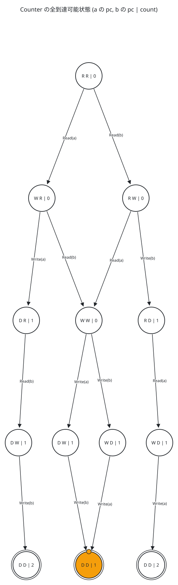
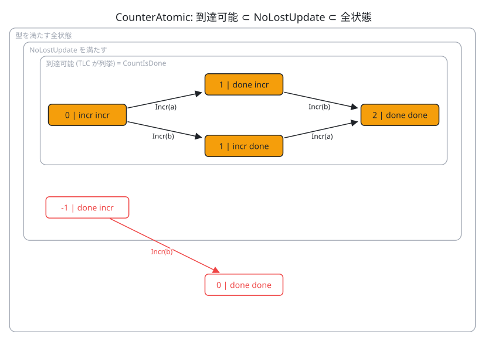

# 緑を読む：Z3 と TLA+ の「OK」は何を保証したのか

<!-- persona: ../../personas/mizchi.md -->

> **想定読者**：Quint / Alloy / Z3 / TLC を、エージェント経由ですでに回している人。
> ツールの入門は省きます。
> 扱うのは、ツールが「OK」「反例なし」と言ったときに、**何が保証されて何が保証されていないか**を自分で判定する基準です。
> 所要 20 分。
> 本文に載せた出力はすべて `npm run verify` で再実行し、本文と照合しています。

---

## 0. 一枚で：結果を読む 4 つの質問

検査器の緑を信じる前に、次の 4 つを順に確かめます。

| # | 質問 | 見落としたときに起きること | 節 |
|---|---|---|---|
| 1 | 答えは **sat / unsat / unknown** のどれか | `unknown`（時間切れ）を「たぶん OK」と読む | [1](#1-z3-は反例探しとして読む) |
| 2 | それは **どの世界** の話か | 32bit 整数では正しいが、JS の `number` では偽 | [1](#1-z3-は反例探しとして読む) |
| 3 | **どの状態** を見たか | k ステップ・有限の定数・帰納法、それぞれ守備範囲が違う | [2](#2-tla-は状態の集合として読む), [3](#3-どの状態を見たか有界全探索帰納法) |
| 4 | それは **何を言う性質** か | 前提が一度も成り立たず空虚に真。あるいは「いつか」が公平性なしに言えない | [4](#4-何を言う性質か空虚さと活性) |

この資料の例は 2 つだけです。
Z3 は TypeScript の小さな関数、TLA+ は「2 プロセスが共有カウンタを 1 ずつ増やす」モデルです。

---

## 1. Z3 は「反例探し」として読む

検証したい性質 P があるとき、Z3 には **¬P を満たす値があるか** を聞きます。

| Z3 の答え | 意味 |
|---|---|
| `sat` | 反例がある。具体的な値が取り出せる |
| `unsat` | 反例がない。**その論理の中では** P が全入力で成り立つ（= 証明） |
| `unknown` | 何も言っていない。時間切れか、決定手続きが諦めた |

### 例：`x % 2 === 1` は奇数判定か

参照実装（最下位ビットが 1）と食い違う `x` を探します。

<!-- source: examples/z3/01-is-odd.mjs -->
```js
// 仕様 (参照実装): 最下位ビットが 1 なら奇数
const isOddSpec = x.and(i32(1)).eq(i32(1));
// 実装: x % 2 === 1   (BitVec の srem は JS の % と同じく「被除数の符号」を持つ)
const isOddImpl = x.srem(i32(2)).eq(i32(1));

const s = new Solver();
s.add(isOddSpec.neq(isOddImpl)); // 「仕様と実装が食い違う x」を探す
```

<!-- output: z3-is-odd -->
```
x % 2 === 1: sat
  counterexample: x = -2147483647
  JS says: -2147483647 % 2 === 1 -> false, (-2147483647 & 1) === 1 -> true
x % 2 !== 0: unsat
```

`sat` の反例は、**実物で再生して**初めてバグ報告になります。
スクリプトが反例を JS の `%` に戻して確かめているのはそのためです。
負の奇数では `%` が `-1` を返す、という既知の罠が出てきました。

### 質問 2：その `unsat` はどの世界の話か

修正版の `unsat` は「32bit 符号付き整数のすべての `x` で正しい」という意味です。
しかし JS の `number` は 64bit 浮動小数点数です。
`x = 1.5` なら `1.5 % 2 !== 0` は `true` になり、1.5 を「奇数」と判定します。
Z3 はこの入力を見ていません。モデルの型が `BitVec 32` だからです。

中点の例でも、世界によって結論が変わります。

<!-- output: z3-midpoint -->
```
(lo + hi) / 2: sat
  mid < lo: true
lo + (hi - lo) / 2: unsat
```

`Int32Array` や Wasm の `i32`、Rust の `i32`（release ビルド）では足し算が回り込みます。そのため `(lo + hi) / 2` は範囲外に出ます。
JS の `number` では、2^53 まで回り込みません。
代わりに `/ 2` が整数を返さない、という別の問題があります。

**証明の強さは、モデルが実装の世界をどれだけ忠実に写したかで決まります。**
型の選択（`Int` か `BitVec 32` か `Real` か `FP` か）は、仕様そのものです。

### 質問 1：`unknown` は「未証明」

<!-- output: z3-unknown -->
```
x^3 + y^3 = z^3 (x,y,z > 0): unknown
3x + 3y = 3z + 1: unsat
```

1 本目の答えは「解なし」が正しいはずです（フェルマーの定理、n = 3）。
それでも Z3 は時間切れで `unknown` を返しました。
非線形の整数算術は一般に**決定不能**です（ヒルベルトの第 10 問題）。
線形なら（Presburger 算術）決定可能で、必ず答えが返ります。

実務で `unknown` を引く原因は、主に次の 2 つです。

- **非線形算術**：変数どうしの掛け算、`%`、`/`。Dafny などで「非線形になると急に通らない」のはこれです。
- **量化子**（`∀`）：Z3 は、ヒューリスティックに具体値を代入して `∀` を扱います（E-matching。代入のきっかけになる項を trigger と呼ぶ）。完全ではありません。

`unknown` と `timeout` は、真とも偽とも結論しないでください。
CI では「失敗」として扱うのが安全です。

---

## 2. TLA+ は「状態の集合」として読む

TLA+ の意味論は小さいです。

- **状態** ＝ すべての変数への値の割り当て
- **振る舞い** ＝ 状態の無限列
- `Spec == Init /\ [][Next]_vars` ＝ 「最初の状態は `Init` を満たし、以後の各一歩は `Next` を満たすか、何も変えない（stuttering）」

TLC は、与えた定数（ここでは `Procs = {"a", "b"}`）で**初期状態から到達可能な状態を全部**列挙します。
そして、各状態で不変条件を評価します。

### 例：read-modify-write のカウンタ

<!-- source: examples/tla/Counter.tla -->
```tla
Read(p) ==
  /\ pc[p] = "read"
  /\ tmp' = [tmp EXCEPT ![p] = count]
  /\ pc'  = [pc  EXCEPT ![p] = "write"]
  /\ UNCHANGED count

Write(p) ==
  /\ pc[p] = "write"
  /\ count' = tmp[p] + 1
  /\ pc'    = [pc EXCEPT ![p] = "done"]
  /\ UNCHANGED tmp
```

不変条件は `NoLostUpdate == Done => count = 2` です。



図は TLC の状態グラフ（`-dump dot`）から機械的に生成しています。
図の状態と遷移は、TLC が列挙したものとちょうど一致します（`vlmkit-anim check --expect` で照合済み）。
ラベルは「a の pc、b の pc | count」で、R = read、W = write、D = done です。
同じラベルの状態が 2 つあるのは、描いていない `tmp` の値が違うためです。

読み方は 1 つです。
**両方が読んでから書く状態（`W W | 0`）を通る道は、すべて `count = 1` で終わります。**
TLC の反例は、その道の 1 本です。

<!-- output: tlc-counter -->
```
Error: Invariant NoLostUpdate is violated.
State 2: <Read("a") line 15, col 3 to line 18, col 20 of module Counter>
State 3: <Read("b") line 15, col 3 to line 18, col 20 of module Counter>
State 4: <Write("a") line 21, col 3 to line 24, col 18 of module Counter>
State 5: <Write("b") line 21, col 3 to line 24, col 18 of module Counter>
/\ count = 1
```

読みと書きを 1 つの action にまとめた `CounterAtomic` では、4 状態すべてで不変条件が成り立ちます。

<!-- output: tlc-atomic -->
```
Model checking completed. No error has been found.
6 states generated, 4 distinct states found, 0 states left on queue.
```

この「No error」が言っているのは、**`Procs` が 2 つのとき、到達可能な 4 状態で成り立つ**ということです。
プロセスが 3 つのときは、別の検査になります。

---

## 3. どの状態を見たか：有界・全探索・帰納法

「OK」の守備範囲は、検査の方式で 3 段階に分かれます。

| 方式 | 見る状態 | 代表例 | 「OK」の意味 |
|---|---|---|---|
| 有界モデル検査 (BMC) | 初期状態から **k 歩以内** に到達できる状態 | Apalache の既定（Quint `verify` もこれ） | k 歩以内には反例がない |
| 明示的な全探索 | 有限の定数で **到達可能な全状態** | TLC | この大きさのインスタンスでは反例がない |
| 帰納法 | **不変条件を満たす全状態**（到達可能かを問わない） | Apalache の inductive check、TLAPS、Lean | どんな大きさ・何歩でも成り立つ |

BMC とは、k 歩の実行を丸ごと 1 つの SMT 式に展開し、Z3 に `sat` かを聞く方式です。
つまり TLA+ と Z3 は、内部でつながっています。
ここでは、同じカウンタを Z3 に直接書いて確かめます。

<!-- output: z3-bmc-induction -->
```
BMC  Counter, k=4: sat
BMC  CounterAtomic, k=4: unsat
IND  CounterAtomic, Inv=NoLostUpdate: base unsat, step sat
  CTI: count=-1, pc=[a:done, b:incr]  --step-->  count=0, pc=[a:done, b:done]
IND  CounterAtomic, Inv=CountIsDone: base unsat, step unsat
```

どの行も「反例を探した結果」です。`unsat` は「反例なし」と読みます。

- **BMC `CounterAtomic` の `unsat`**：4 歩以内には反例がない。5 歩目のことは何も言っていません。
- **帰納法**：「`Init ⇒ Inv`」（基底）と「`Inv ∧ Next ⇒ Inv'`」（一歩）を示せれば、歩数に関係なく成り立ちます。
- **`NoLostUpdate` の一歩が `sat`**：正しい不変条件なのに、帰納法では示せません。

最後の点が肝です。図にすると、こうなります。



帰納法の一歩は、**不変条件を満たす任意の状態**から出発します。
`count = -1` は到達不能ですが、`Done` ではありません。そのため `NoLostUpdate` を（空虚に）満たします。
そこから一歩進むと条件が破れます。
このような状態を CTI（counterexample to induction：帰納法の反例）と呼びます。

CTI が出ても、それだけではバグではありません。**不変条件が弱すぎる**という意味です。
直し方は、到達不能な状態を排除する条件を足すことです（帰納的強化）。
ここでは `count = 終わったプロセスの数` を足しました（`CountIsDone`）。
するとこの条件を満たす状態は到達可能な 4 状態とちょうど一致し、一歩で外へ出る道が消えます。

有界検査・全探索から帰納法に進むとき、人間の仕事は **この強化を見つけること**です。
AI が出した帰納的証明をレビューするときも、見るべきはここです。
足された補題がドメインの言葉で意味を持つかを確かめます。

---

## 4. 何を言う性質か：空虚さと活性

### 空虚な真（vacuity）

`Done => count = 2` は、`Done` に一度も到達しなければ常に真です。
`Done` の綴りを誤る、`Next` の条件が強すぎて誰も終われない。どちらでも緑になります。

対策として、**破れるべき不変条件**を置いて、破れることを確かめます。

<!-- source: examples/tla/Witness.cfg -->
```
\* 「わざと破れるべき」不変条件。違反 = Done に到達できる証拠。
\* これが通ってしまったら NoLostUpdate の合格は空虚 (vacuous)。
SPECIFICATION Spec
INVARIANT NotDone
```

<!-- output: tlc-witness -->
```
Error: Invariant NotDone is violated.
/\ count = 2
```

Z3 でも同じことが起きます。
前提（`s.add(...)` した制約）が矛盾していると、どんな性質を聞いても `unsat` になります。
性質を足す前に、**前提だけで `sat` になるか**を一度確かめてください。

### 安全性と活性（safety / liveness）

- **安全性**：「悪いことは起きない」。有限の反例（悪い状態に着く道）で破れる。不変条件はこちら。
- **活性**：「良いことはいつか起きる」（`<>Done`）。無限の振る舞いでしか破れない。

`Spec` は「何も変えない一歩」を許します。
そのため「永遠に足踏みする」振る舞いも、仕様を満たしてしまいます。

<!-- output: tlc-liveness-unfair -->
```
Error: Temporal property Termination was violated.
State 3: Stuttering
```

`WF_vars(Next)`（弱公平性：「ずっと実行可能な action は、いつか実行される」）を仮定すると通ります。

<!-- output: tlc-liveness-fair -->
```
No error has been found.
```

公平性は、**スケジューラやネットワークについての仮定**です。
プロセスがクラッシュしうるなら、その WF は嘘になります。
活性の「OK」を読むときは、どの公平性を仮定したかを必ず確かめてください。

---

## 5. AI が書いたモデルをレビューするチェックリスト

- [ ] **3 値**：`unknown` / `timeout` を成功扱いしていないか
- [ ] **世界**：変数の型（`Int` / `BitVec` / `FP`）、定数の大きさ、省いた変数は、実装と対応しているか
- [ ] **反例の再生**：`sat` や反例トレースを、実コードのテストとして再生したか
- [ ] **前提の充足**：前提だけで `sat` になるか。`Init` と `Next` で目的の状態に到達できるか（witness）
- [ ] **守備範囲**：BMC の k、TLC の定数、帰納法。どれの「OK」かを報告に書いたか
- [ ] **帰納的強化**：足された補題は、ドメインの言葉で説明できるか
- [ ] **公平性**：活性の OK は、どの公平性の仮定に依存しているか。その仮定は現実に成り立つか

---

## 6. 理解度チェック

答えを開く前に、1 行で答えてみてください。

<details><summary>Q1. Z3 が <code>unsat</code> を返した。これは「実装が正しい」ことの証明か？</summary>

いいえ。証明されたのは「モデルの世界（型・前提）では反例がない」ことだけです。
`x % 2 !== 0` は `BitVec 32` では正しいですが、JS の `number` の `1.5` では誤判定します。
</details>

<details><summary>Q2. Apalache で <code>--length=10</code> の検査が通った。11 歩目で壊れることはあるか？</summary>

あります。BMC が言っているのは「10 歩以内に反例なし」だけです。
歩数によらず成り立つと言うには、帰納的不変条件の検査（または TLC の全探索で状態空間を尽くすこと）が必要です。
</details>

<details><summary>Q3. 正しい不変条件なのに、帰納法の一歩で反例（CTI）が出た。何を疑う？</summary>

不変条件が弱すぎることです。
CTI は多くの場合、到達不能な状態から出発しています。
到達不能な状態を排除する条件を足して（強化して）、もう一度試します。
</details>

<details><summary>Q4. <code>Done => count = 2</code> が TLC で通った。これだけで安心できない理由は？</summary>

`Done` に一度も到達しないなら、空虚に真だからです。
`NotDone` のような、破れるべき不変条件が実際に破れることを確かめます。
</details>

<details><summary>Q5. <code>&lt;&gt;Done</code> が stuttering の反例で落ちた。<code>WF_vars(Next)</code> を足せば解決か？</summary>

検査は通ります。ただし、それは「実行可能な action がいつか実行される」という仮定を足したからです。
クラッシュや無限の遅延がありうるシステムなら、その仮定を正当化できるかが本当の問いです。
</details>

---

## 付録：再現

```sh
npm install              # Node 24+
npm run setup:tla        # TLC (tla2tools.jar) を .tools/ に取得。Java 11+
npm run verify           # 例の再実行 → 本文の出力と照合 → 図の検査 → HTML を vlmkit で検査
```

| ファイル | 内容 |
|---|---|
| `examples/z3/*.mjs` | Z3 の例（npm `z3-solver`、TypeScript と同じ API） |
| `examples/tla/*.tla`, `*.cfg` | TLA+ の例と TLC の設定 |
| `figures/*.scene.json` | 図の元（vlmkit-anim）。`*.expect.json` は図が守るべき事実 |
| `checks.json` | 本文に引用した出力を再生成するコマンドと、期待する行 |
