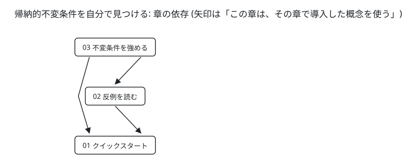

# 帰納的不変条件を自分で見つける

<!-- persona: ../../personas/mizchi.md -->

> **想定読者**：TLA+ / Quint が読めて、TLC や Apalache をエージェント経由で回している人。
> ツールの入門は省きます。
> 扱うのは、帰納法の検査が落ちたときに、**原因を判定して、足すべき条件を自分で書く**ことです。
> 全 3 章、合計 40 分弱。
> 本文に載せた出力と演習の答えは、すべて `npm run verify:book` で再実行して照合しています。

## この本で身につくこと

| 章 | 読み終えたらできること |
|---|---|
| [01 クイックスタート](01-quickstart.md)（10 分） | Apalache の 3 つの check で、不変条件が何歩でも成り立つことを示せる。「length N」の出力を、コマンドから読み分けられる |
| [02 反例を読む](02-reading-cti.md)（12 分） | 帰納法の検査が落ちたとき、条件が弱すぎるのか、性質が本当に破れるのかを TLC で判定できる |
| [03 不変条件を強める](03-strengthening.md)（15 分） | 反例から足すべき条件を読み取り、3 つの check を通せる。足した条件をドメインの言葉で説明できる |



矢印は「この章は、その章で導入した概念を使う」という意味です。
図は `book.json` から生成しています。

## 再現

```sh
npm install              # Node 24+
npm run setup:tla        # TLC と Apalache を .tools/ に取得。Java 17+
npm run verify:book      # 本の構造 → 各章の出力と演習の答え → 図 → HTML を検査
```

| ファイル | 内容 |
|---|---|
| `book.json` | 章の順序、学習目標、導入する概念、演習と答えの検査 |
| `checks.json` | 本文に引用した出力と、演習の答えを再生成するコマンド |
| `examples/tla/` | 章で使う TLA+ 仕様（Apalache 用の型注釈つき） |
